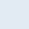

# school-website

### [smule.yessness.com](https://smule.yessness.com/)

This is a website built for school purposes; to display my school projects along with some other things. It also acts as a personal portfolio.

The website is part of the [Yessness](https://yessness.com/) domain, owned by [graphide studios](https://github.com/graphide).

### Designs

It has two primary designs:

- The new and improved, simplistic design: [smule.yessness.com](https://smule.yessness.com/).
- The old and more cluttered design: [old.smule.yessness.com](https://old.smule.yessness.com/).

### Libraries used:

The website uses the following libraries:

- [jQuery](https://jquery.com/)
- [vanilla-tilt](https://micku7zu.github.io/vanilla-tilt.js/)

Rest of code is solely my own, but can be forked and used as long as proper credit is given where needed.

### Branding:

The color scheme used on the website is as following:

Alice Blue                     | Charcoal                      | Sunglow                               | Mango Tango
:-----------------------------:|:-----------------------------:|:-------------------------------------:|:----------------------------------:
 |  |  |
Light                          | Dark                          | Accent Light                          | Accent Dark
rgb(226, 235, 243)             | rgb(47, 60, 76)               | rgb(243, 115, 53)                     | rgb(253, 200, 48)
